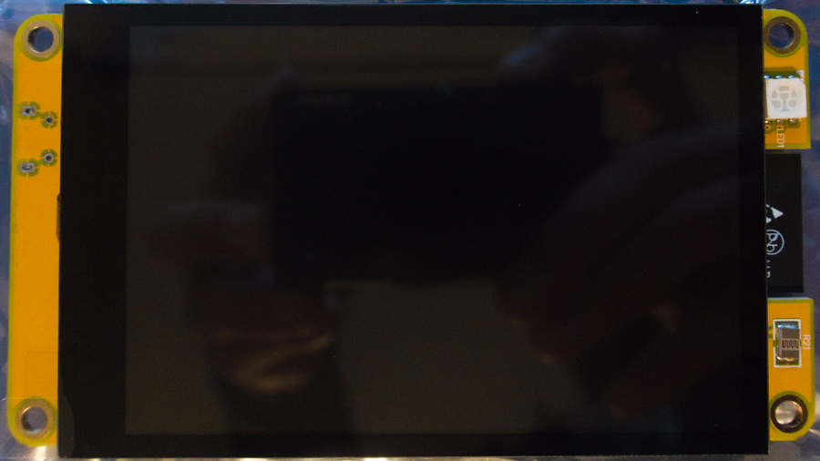
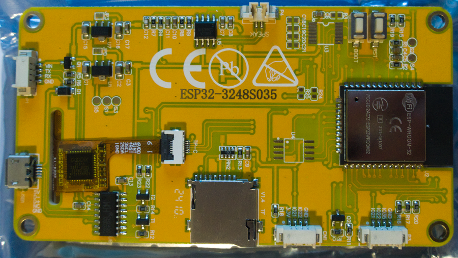
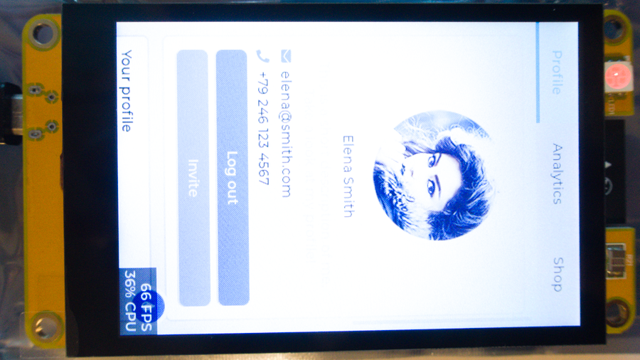
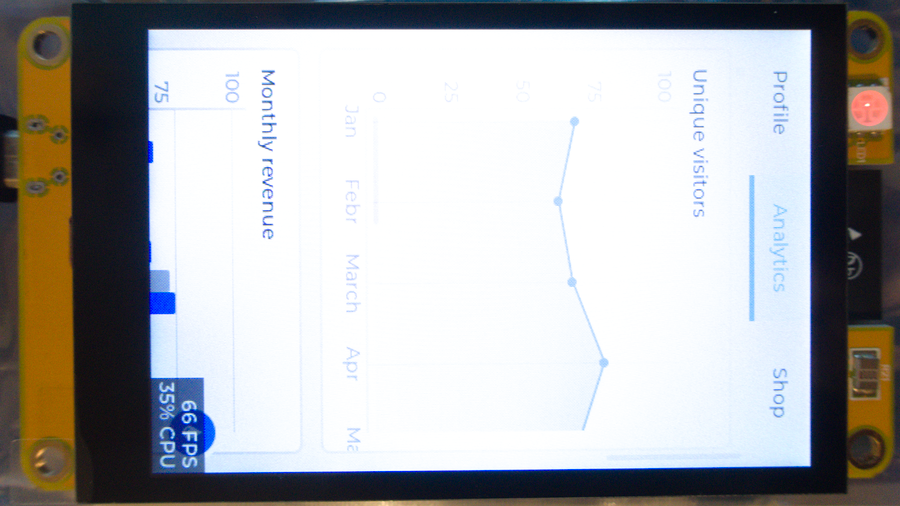
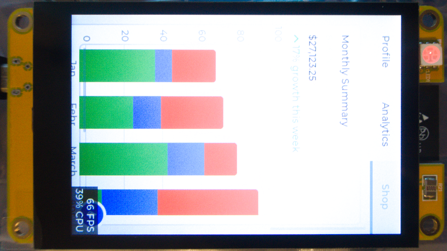
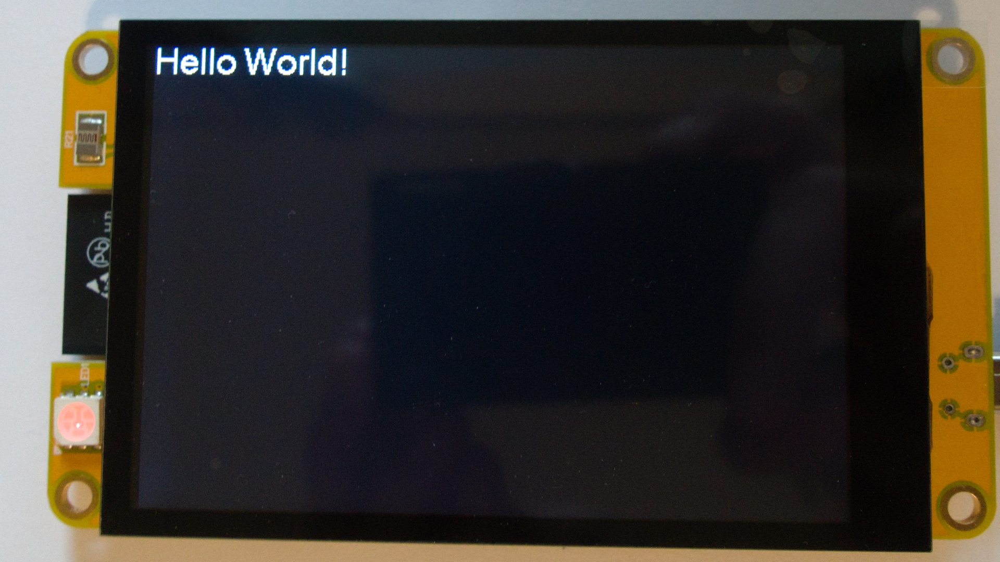
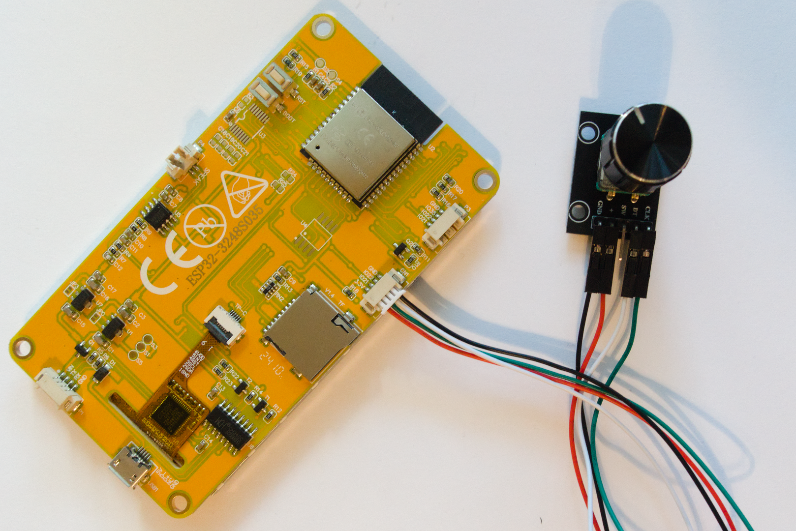

# Getting Started with an esp32-with-display
How to get started with a ESP32-3248S035 capacitive 3.5 inch display with an esp32

## Out of the Box
The board was listed on Amazon like this
```
3.5" inch ESP32 Display ESP-WROOM-32 Capacitive Touch Screen TFT LCD Module 320x480 ST7796 ESP32-3248S035C Development Board for Arduino IDE
```
at [this link](https://www.amazon.com/gp/product/B0C4KSKW96)

The front looks like this

The back looks like this


If you power it on it has an image with some buttons in the tabs that look like this



and has some system stats in the corner also. The LED has turned on with a dim, red. I assume this means it's working.

## Run an Example
The next thing to do is run an example. I have not used PlatformIO for a bit, but that will be my target via VS Code. There seems to be some information [here](https://registry.platformio.org/libraries/rzeldent/esp32_smartdisplay) with an active repo [here](https://github.com/rzeldent/esp32-smartdisplay-demo)

I started by using Git Desktop on Windows to clone the repo, but it seems that both the repo and PlatformIO would like the actual Git to be installed, so I did that by following the links that popped up in VS Code

Since I have not run PlatformIO in a while, it also wanted to run some updates, so I waited for all of that to happen. It seems to want a Microsoft C++ compiler also, but I must have had something the last time I used it. I also seem to be missing Arduino.h (and some other .h files), but again, I should have had this before.

The project wanted to get lvgl (and some other items), which took about 20 minutes.

The Arduino.h error is still there, but the project must have successfully pulled other dependencies as the other .h issues in main.cpp have resolved

A search says that a build still might work, so I plugged in the board via USB and tried the PlatformIO upload button. A lot of errors trying to compile a lot of items, but no change to the header status and no upload to the board

I may have needed to install the driver for the board which one can find [here](https://learn.sparkfun.com/tutorials/how-to-install-ch340-drivers/all#drivers-if-you-need-them)
Yep, after installing the driver and relaunching VS Code, I can see the board in the PlatformIO devices list

I tried the upload arrow again, but the build is still not working. Still have the the Arduino.h issue, but it seems to be missing a sub-dependancy, arduino_pins.h.
[This](https://community.platformio.org/t/fatal-error-pins-arduino-h-no-such-file-or-directory/19634/5) says to exit VS Code, remove the .platformio directory and restart VS Code
You will have to wait for PlatformIO to reinstall. There was some CMakeLists.txt dropdown thing going on, but the install seemed to finish and it configured the project and the Arduino.h error is now gone

Getting this far I have also run into [this](https://github.com/witnessmenow/ESP32-Cheap-Yellow-Display/blob/main/SETUP.md) helpful repo for an older version of the board. This is where the driver information came from.

The compile is going better and trying to upload to the board now, but it seems to be trying to do all boards.
We need to go to the platformio.ini and uncomment this line to set our board as the default
```
default_envs = esp32-3248S035C
```
This will also trigger a project configuration, which we will have to wait for

This will now compile and upload to the board successfully, but it's just blank now

My earlier attempts may have screwed up the .pio folder that is created. Docs from the example say to delete the directory if there are any changed to the lv_conf.h file. So I will delete that and recompile.
This seems to trigger a long (like 20 min) reinstallation of lvgl. It does compile and load, but it's still blank after this.
It also seemed to need a restart of VS Code to see some of the .h files again.

After finding the screen driver for this board I changed this line in lv_conf.h
```
#define LV_USE_ST7796		1
```
However, it did not seem to help. It did rebuild the .pio directory much faster this time.

## Reset, Back to Basics
I tried a number of things to try to jump to a working example with many features of the board, but none of them would work. So I went back to [this old video](https://dronebotworkshop.com/platformio/) on how to use PlatformIO. Then I got the Sunton (the manufacturer of the board) zip file with this Python code:
```
"""
Download a zip file
"""
import requests, os
from zipfile import ZipFile
from io import BytesIO

url = 'http://pan.jczn1688.com/directlink/1/ESP32%20module/3.5inch_ESP32-3248S035.zip'
dest = 'C:/Users/dave/Downloads'

os.chdir(dest)

# Send a GET request to the URL
response = requests.get(url)

# Check if the request was successful
if response.status_code == 200:
    with ZipFile(BytesIO(response.content)) as zip_file:
        zip_file.extractall()
    print("Files extracted successfully")
else:
    print(f"Failed to download file: {response.status_code}")
```
since browsers now stop you from downloading a zip from a non-https URL. I combined the hello and LED example scripts with a bit of modification and following the video's setup for a project. [This](esp32-hello-world) worked. Now I will have to start layering on features one-by-one the slow, hard way.

## Simple Display Example
Build environments are a pain. It took two days to see this:

The part that caused the most confusion was how PlatformIO handles dependancies. It seems that I needed to have all '#define's in the platformio.ini file with a build_flags entry. Like this
```
; These are needed even with the correct User_setup.h so that dependancies
; in the .pio direcory build correctly
build_flags =
    -D USER_SETUP_LOADED
    -D TFT_WIDTH=320
    -D TFT_HEIGHT=480
    -D TFT_BL=27
    -D TFT_BACKLIGHT_ON=HIGH
    -D ST7796_DRIVER
    -D TFT_MISO=12
    -D TFT_MOSI=13
    -D TFT_SCLK=14
    -D TFT_CS=15
    -D TFT_DC=2
    -D TFT_RST=-1
    -D TOUCH_CS=33
    -D LOAD_GLCD
    -D LOAD_FONT2
    -D LOAD_FONT4
    -D LOAD_FONT6
    -D LOAD_FONT7
    -D LOAD_FONT8
    -D LOAD_GFXFF
    -D SMOOTH_FONT
    -D SPI_FREQUENCY=65000000
    -D SPI_READ_FREQUENCY=20000000
    -D SPI_TOUCH_FREQUENCY=2500000
```
Then to be sure everything was updated, I deleted the .pio directory and restarted VS Code. Then rebuilt the project, which worked even though there were some editor warnings until the compile was done.
The project for this is [here](screen-test)

Now I think I know what I need to get some other examples to run before I start with an actual project. I have gotten these included projects to also run:
* [tft-rainbow](tft-rainbow) Draws a few things to the screen
* [flash_png](flash_png) Draws a panda PNG to the screen with different backgrounds. Does not use the card reader, but loads via a .h file to flash instead. I needed to move a function to the top of the code so it would not be seen as undeclared
* [tf_card](tf_card) This one is not working yet. It will not see the card if it is >4G and will fail at initialization. With a 4G card it sees the card, but seems to have trouble reading the file. I will test with another card soon
* [rotary_encoder](rotary_encoder) This is not one of the included programs, but I will need a rotating dial for a project and this was just a quick test. This was the hook up with the included connector

Seems to work fine given 3.3 volts. Thanks to [The Drone Bot Workshop](https://dronebotworkshop.com/rotary-encoders-arduino/) for a place to start. Encoder was left over from a [light up dress project](https://www.youtube.com/watch?v=S583nWCTwY8)


I have not been able to get the repo from rzeldent to run, but in a CYD (cheap yellow display) forum note, he seems to have hacked his copy for a different refresh rate. I will try a different board later, but I think I have what I need for now.

I was able to get the rzeldent demo to run for another board